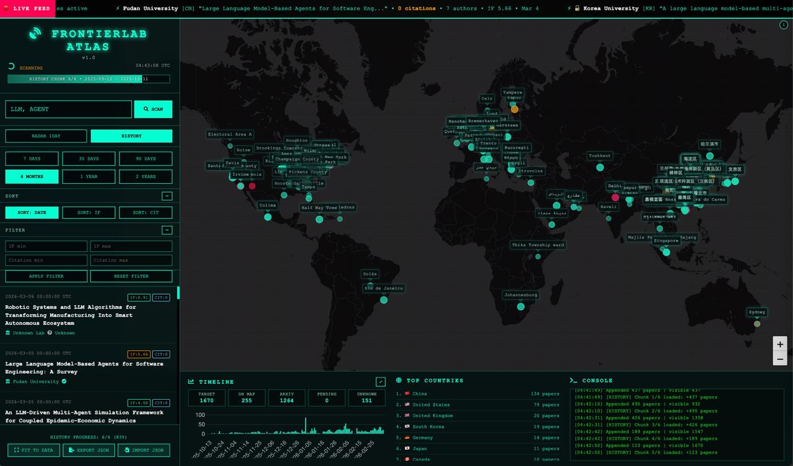
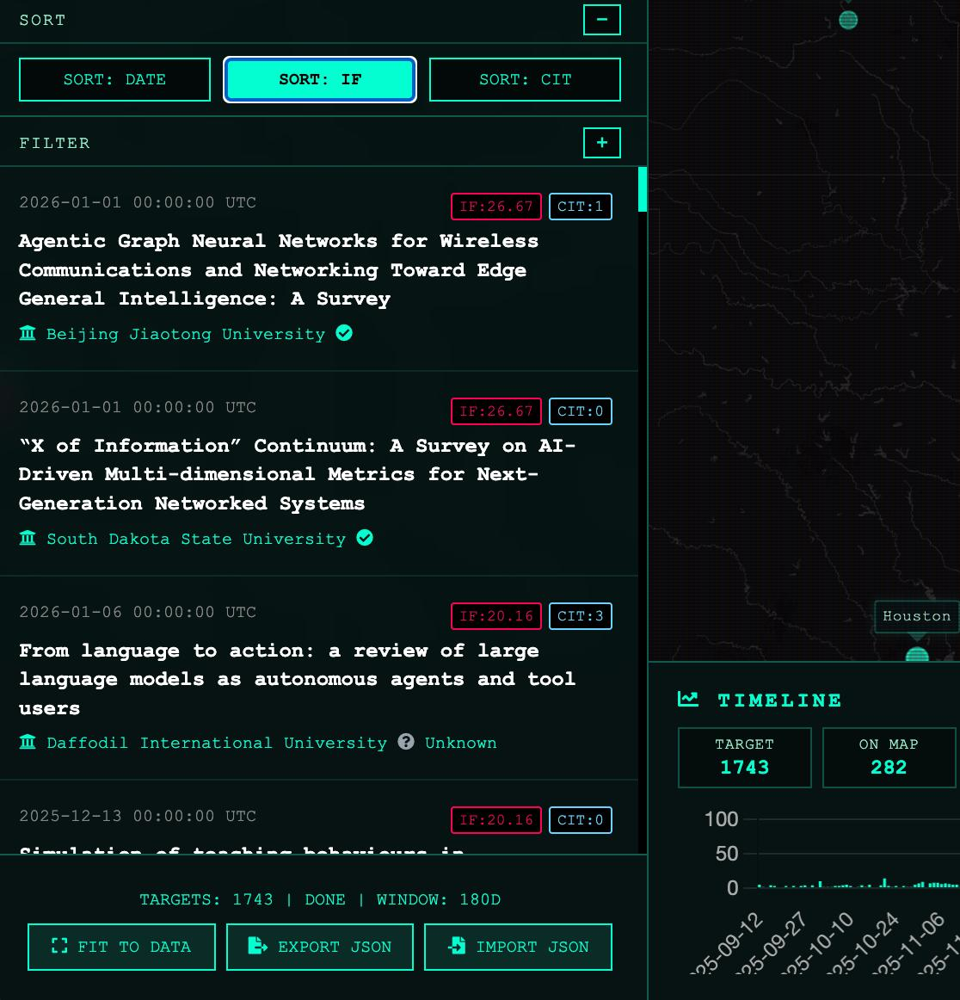
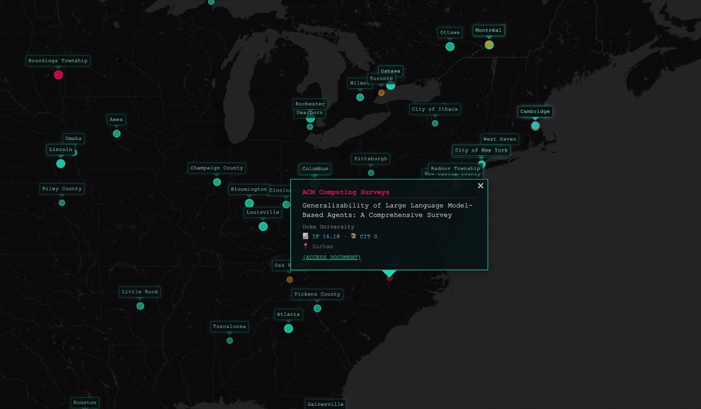
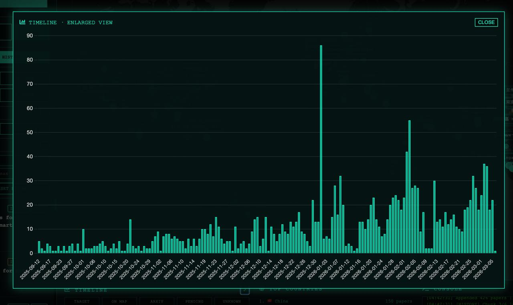

<p align="center">
  <h1 align="center">🌍 FrontierLab Atlas</h1>
  <p align="center"><strong>PhD Lab & Journal GeoNavigator</strong></p>
  <p align="center">
    A modern research-intelligence map for new PhD students to quickly locate
    <strong>frontier labs</strong>, understand <strong>global research geography</strong>,
    and track <strong>high-impact journals/preprints</strong>.
  </p>
</p>

<p align="center">
  
  
  
  
</p>

---

## ✨ Why it matters for PhD onboarding

Thousands of papers are published every day, but only a small subset are truly field-shaping.
Experienced PhDs usually know the “must-follow labs” already — this app helps new researchers reach that clarity much faster.

FrontierLab Atlas helps you answer in minutes:

- **Which labs are truly active at the frontier of my topic?**
- **Where are those labs located on the map?**
- **Which venues are repeatedly producing high-quality work?**

### What you get, fast
- 🧭 Move from keyword to global lab landscape in one workflow
- 📍 Quickly see where the strongest labs are concentrated
- 📈 Filter and sort by IF/CIT to reduce noise
- 📚 Build a practical “who to follow” list instead of reading blindly

> The goal: get in weeks what often takes 2–3 years of trial-and-error during a PhD.

---

## 🖼 Screenshots

<p align="center">
  
</p>
<p align="center"><em>Global overview: map + paper stream + timeline + console in one workspace.</em></p>

<p align="center">
  
</p>
<p align="center"><em>Search workflow with sort/filter and IF/CIT signals.</em></p>

<p align="center">
  
</p>
<p align="center"><em>Geo marker popup with venue, institution, IF and citation info.</em></p>

<p align="center">
  
</p>
<p align="center"><em>Enlarged timeline for publication density and trend reading.</em></p>

---

## 🚀 Core capabilities

### 1) Dual working modes

- **RADAR 1DAY** *(monitoring mode)*
  - Runs continuously to surface newly relevant papers
  - Starts with a strict 1-day window (fresh signal first)
  - Auto-fallback to 7-day when daily volume is too sparse
  - Includes countdown in UI so you always know next refresh timing

- **HISTORY** *(exploration mode)*
  - One-shot historical retrieval for mapping a field quickly
  - Time windows: `7D`, `30D`, `90D`, `6M`, `1Y`, `2Y`
  - Large windows fetched in **30-day chunks** with progress for stability

**When to use which mode**
- Use **RADAR** when you already know your topic and want to keep tracking the frontier.
- Use **HISTORY** when entering a new subfield and you need a fast landscape overview.

### 2) Keyword logic (strict AND)
- Comma-separated terms use strict **AND** matching on title/abstract
- Example: `LLM, Agent` means both terms must appear
- This avoids broad noisy retrieval and keeps results aligned with your actual research intent

### 3) Quality & trend signals
- Journal papers show **IF proxy** (`2yr_mean_citedness` from OpenAlex sources)
- Preprints are labeled **ARXIV**
- **Citation badge (CIT)** + sorting by Date / IF / Citation
- Together, these signals help you spot high-quality labs and follow emerging trends faster

### 4) Robust geo behavior
- arXiv excluded from geocoding pending queue
- Non-arXiv geocoding retries up to 2 times
- After 2 failures, status becomes `unknown` and is cached

### 5) Research usability
- Import / Export JSON
- Import restores query/mode/days/filters context
- Numeric filters: IF min/max + Citation min/max
- Timeline enlarged modal view

---

## 🧱 Tech stack

- Python 3.10+
- Flask
- OpenAlex API (`works`, `sources`)
- Leaflet + Chart.js frontend
- Gunicorn (recommended in production)

**Key files**
- `paper_app.py` — API + scan/geocode orchestration
- `paper_fetcher.py` — OpenAlex retrieval + relevance/IF enrichment
- `geocoder.py` — geocode/cache logic
- `templates/paper_earth.html` — UI and interaction logic

---

## ⚡ Quick start

```bash
cd frontierlab-atlas
python3 -m venv .venv
source .venv/bin/activate
pip install -r requirements.txt
cp .env.example .env
python3 paper_app.py
```

Open: `http://127.0.0.1:5000/`

---

## 🔐 Configuration & key hygiene

### Minimal `.env` (copy/paste)

```env
MAPS_CO_API_KEY=your_maps_co_key
OPENALEX_MAILTO=your_email@example.com
```

### What is actually required
1. **`MAPS_CO_API_KEY`** (required)
   - Used for institution/location geocoding
   - Provider endpoint: `https://geocode.maps.co/...`
2. **`OPENALEX_MAILTO`** (recommended, not a key)
   - Optional contact email for OpenAlex polite pool
   - OpenAlex itself is accessed via public API endpoints

### Not used in FrontierLab Atlas core
- `OPENALEX_API_KEY` (not read by current code)
- `OPENCELLID_API_KEY`
- `HF_TOKEN`

### Best practices
- Never commit `.env` or real credentials
- Keep `.env.example` as the only tracked template
- Rotate keys immediately if exposure is suspected

---

## 🌐 Self-hosting checklist

- Linux server (recommended: **2 vCPU / 4GB RAM** minimum)
- Python 3.10+
- Reverse proxy + TLS (Caddy/Nginx)
- Gunicorn + systemd in production
- Writable `data/` directory for cache files

---

## 🧭 API endpoints

- `GET /api/papers?q=<query>&days=<n>&from=<YYYY-MM-DD>&to=<YYYY-MM-DD>&lite=0|1`
- `GET /api/papers/status`
- `GET /api/stats?days=<n>`
- `GET /api/default-seed`

---

## 🙌 Attribution

- **Author:** OPENCLAW
- **Product direction / instruction:** Yang Tang

## 📄 License

Please align `LICENSE.md` to your intended release model before public launch.
